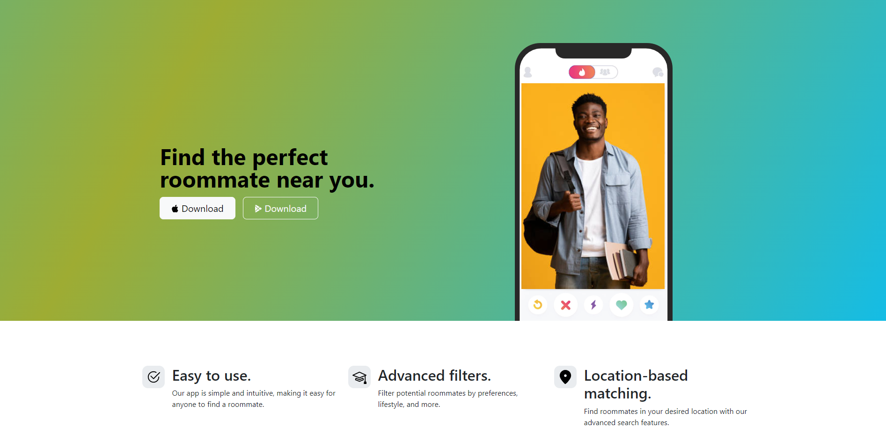
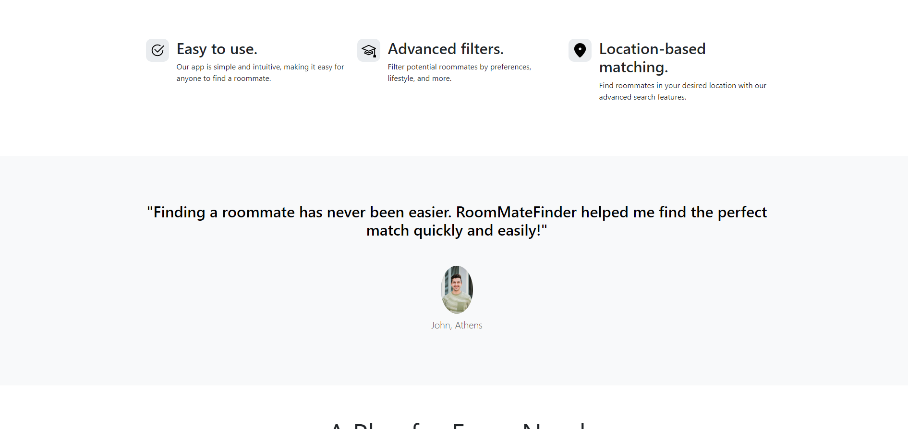
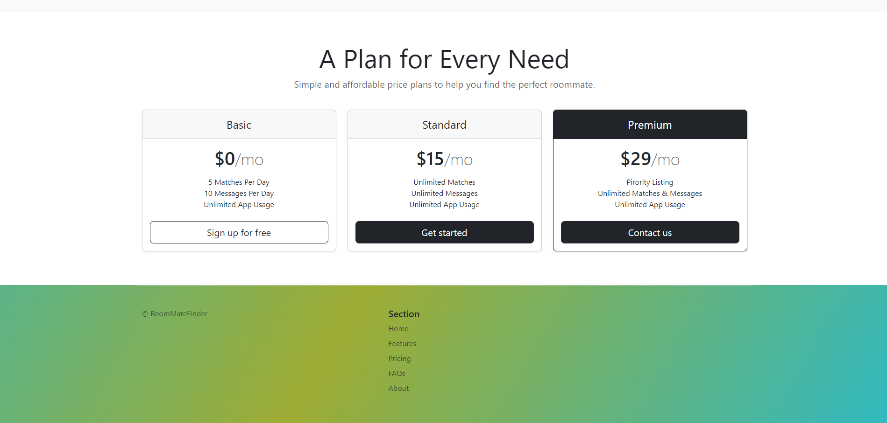

# RoomMateFinder
This project focuses on providing a clean and easy to use interface that allows the users to experience the visual layout of the page and potentially functionallity of the platform. Although currently these buttons remain inactive and there is minimal interaction between them, they serve as an anticipatory example aimed at providing some insights into what this platform could offer in the future

## Technologies Used: HTML, CSS, Bootstrap.

## Screenshots

